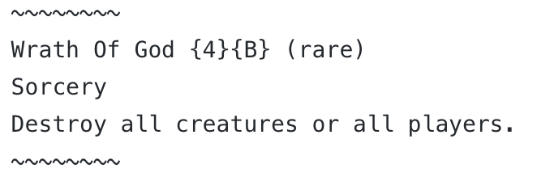

# mtg-gpt-2-cloud-run

Code and UI for running a Magic card text generator API using [gpt-2-cloud-run](https://github.com/minimaxir/gpt-2-cloud-run). The card image in the UI is generated by [mtg-card-creator-api](https://github.com/minimaxir/mtg-card-creator-api). You can play with the API [here](https://minimaxir.com/apps/gpt2-mtg/).

It turns out finetuning GPT-2 overfits Magic cards *very* quickly due to its more-structured format. The workaround is to use the random field encoding option offered by [mtgencoding](https://github.com/billzorn/mtgencode) (which generates a random order for each individual card after removing the random seed: see changes in [mtg-card-creator-api](https://github.com/minimaxir/mtg-card-creator-api)), generate such encodings many times, and concatenate them together (e.g. via `concat.py`). As a bonus, this gives the network the ability to condition on any combination of fields as it'll see many different combinations of fields. (see `encoding_examples.txt` for examples of cards following this encoding)

The network was trained with GPT-2 117M via [gpt-2-simple](https://github.com/minimaxir/gpt-2-simple) for 6500 steps (about 2 hours on a P100 GPU / $1). Despite that relatively low amount of training, GPT-2 still overfits on names and rules text!

You can see examples of card text generation at various temperatures in the `generated_card_dumps` folder. Temperatures 0.7 and 1.0 are mostly normal, 1.2 is when the network starts making its own mechanics/cards, 1.5 and 2.0 is when the network becomes [MTGCardsmith](https://whymtgcardsmith.tumblr.com/archive).

## Helpful Notes

* To share the generated card image, you can Save As the generated card locally, and to use it elsewhere, rename it and add a `.jpg` file extension.
* Since the network overfits, the temperature doesn't have a huge impact; a random temperature between 0.7 and 1.0 is used to make output more random/exciting.
* The network can recite existing card names and rules text of existing cards, but rarely to the same card. The network often makes interesting color shift decisions with changes to CMC/Rarity.
* In terms of color accuracy, color pie is mostly correct. Creature types and mechanics often follow the appropriate color identity. P/T, mana cost, and rarity are balanced.
* Occasionally, it does get card types wrong, e.g. P/T on noncreatures.

## See Also

* [char-embeddings](https://github.com/minimaxir/char-embeddings) — My first attempt at generating Magic cards with a neural network (GPT-2 is much better!).
* [RoboRosewater](https://twitter.com/roborosewater) — Twitter account which pioneered the use of text generation for Magic cards.
* [DroidRosewater](https://twitter.com/droidrosewater) — Variant of RoboRosewater which allows user input (although it cheated a bit due to how the RNN generates). Credit to Shoghi for [pointing me](https://twitter.com/shoghicp/status/1124470256976707585) to the wine solution for generating cards!

## Maintainer/Creator

Max Woolf ([@minimaxir](https://minimaxir.com))

*Max's open-source projects are supported by his [Patreon](https://www.patreon.com/minimaxir). If you found this project helpful, any monetary contributions to the Patreon are appreciated and will be put to good creative use.*

## License

MIT

## Disclaimer

This repo has no affiliation or relationship with OpenAI or Wizards of the Coast.